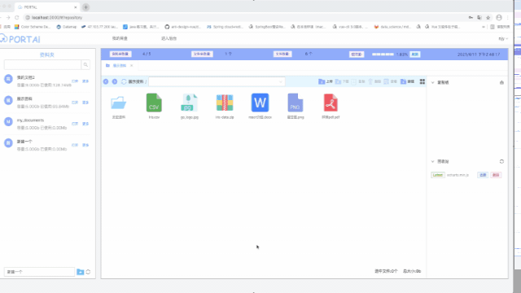

# 

一款基于OSS的快速文件交换，存储的网盘应用

A fast file exchange and storage network disk application based on OSS

**The Backend Server project URL:**
https://github.com/nijiayu0914/file_exchange


***

## 主要功能

1）资料分区，文件存储

2）支持同一账号多点同时登陆，支持不同客户端(PC)之间文件互传，共享

3) 支持文件系统常规操作，上传，下载，预览，复制，粘贴，分享

4）对不同文件格式，拥有上百种Icon,支持区分展示

5）拥有回收站功能，防止误删

6）支持版本控制，拥有30天的历史存档记录，可回档

7）拥有极简的后台管理系统，可调整用户配额

***

## 功能演示

#### **上传**


#### **资料夹操作**


#### **文件操作**


#### **高级功能**



#### **管理后台**


***

### How to build image

项目用React开发，并打包成Docker镜像

The project is developed by React and packaged by docker.

**the way to build the docker image:**

docker build -t portal:latest .

***

### How to run project

项目服务使用Nginx作为代理，使用https对外发布，可根据实际情况，更改配置

env文件夹下可更改项目的环境变量，如后端服务接口地址等

```text
REACT_APP_BASE_URL=/api  # the backend api root url 
REACT_APP_HTTPS=true  # https or http
```

项目后端服务基于Aliyun OSS，使用golang iris框架开发

The backend service of the project is based on aliyun OSS and developed with golang iris framework


**Run with https**
```bash
// this is an example

docker run --name portal_frontend --privileged --network host -itd -p 443:443 \
-v /config/portal/nginx.conf:/etc/nginx/nginx.conf \
-v /config/portal/portal.happyworkhardlife.com.key:/etc/nginx/portal.xxx.com.key \
-v /config/portal/portal.happyworkhardlife.com.pem:/etc/nginx/portal.xxx.com.pem \
-v /config/portal/www.portal.happyworkhardlife.com.key:/etc/nginx/www.portal.xxx.com.key \
-v /config/portal/www.portal.happyworkhardlife.com.pem:/etc/nginx/www.portal.xxx.com.pem portal

```

### The Backend Server project URL

https://github.com/nijiayu0914/file_exchange


